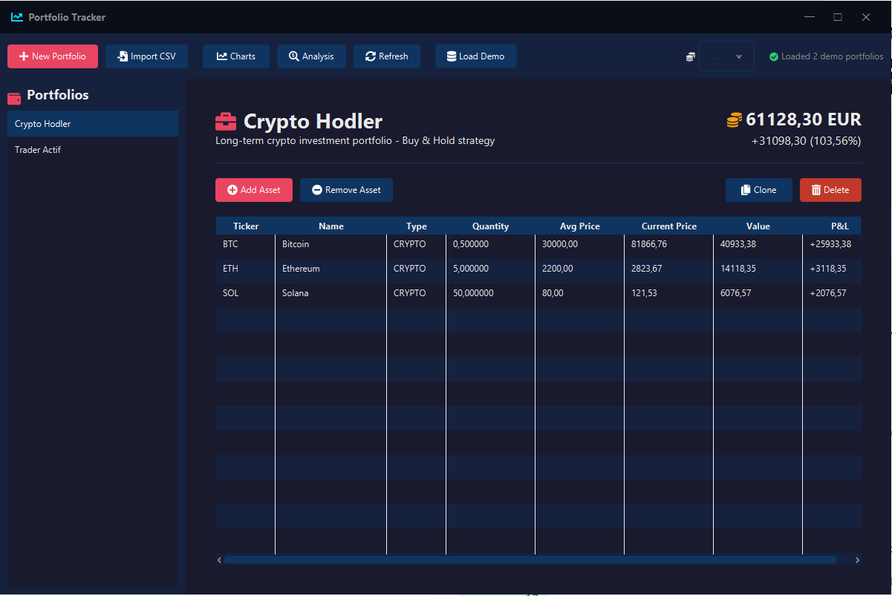
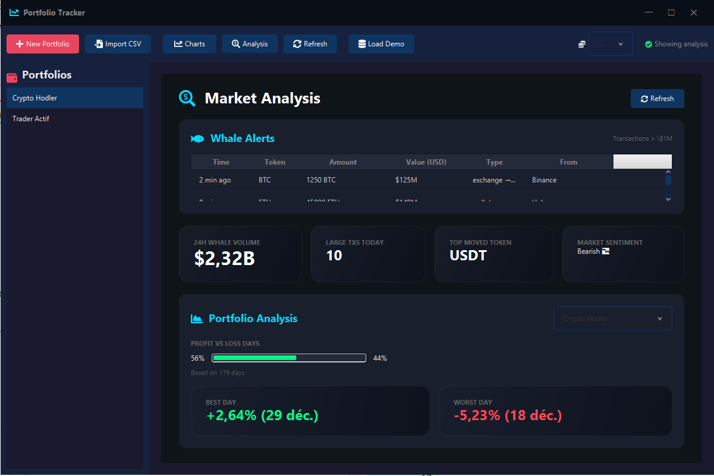
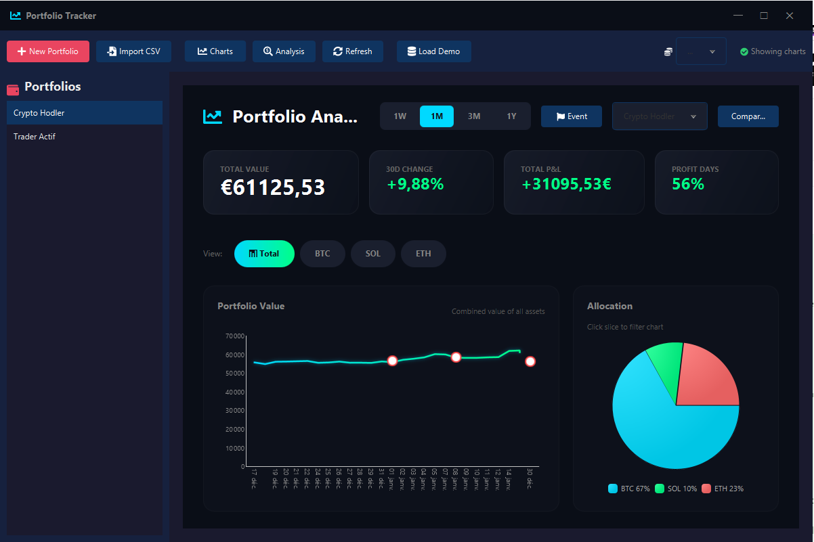

<div align="center">
  <a href="https://github.com/chevroski/Portfolio-Tracker-">
    
  </a>

  <h1 align="center">PortfolioTracker</h1>

  <p align="center">
    Une solution élégante et performante pour le suivi de portefeuilles financiers (Crypto & Stocks).
    <br />
    <em>Projet Scolaire - Module II.1102 (Programmation Java Avancée)</em>
    <br />
    <br />
    <a href="docs/doc2/Rapport%20technique-%208%20Pages.pdf"><strong>Lire le Rapport Technique (8 pages) »</strong></a>
    <br />
    <br />
    <a href="#demo">Voir la Démo</a>
    ·
    <a href="#fonctionnalités">Fonctionnalités</a>
    ·
    <a href="#installation">Installation</a>
  </p>
</div>

<!-- BADGES -->
<div align="center">
  
  
  
  
  
</div>

<br />

<!-- TABLE DES MATIÈRES -->
<details>
  <summary>Table des matières</summary>
  <ol>
    <li>
      <a href="#à-propos-du-projet">À propos du projet</a>
      <ul>
        <li><a href="#construit-avec">Construit avec</a></li>
      </ul>
    </li>
    <li><a href="#fonctionnalités">Fonctionnalités</a></li>
    <li><a href="#captures-décran">Captures d'écran</a></li>
    <li><a href="#architecture-et-conception">Architecture et Conception</a></li>
    <li><a href="#tests-unitaires">Tests Unitaires</a></li>
    <li>
      <a href="#installation">Installation</a>
      <ul>
        <li><a href="#prérequis">Prérequis</a></li>
        <li><a href="#lancement">Lancement</a></li>
      </ul>
    </li>
    <li><a href="#contact">Contact</a></li>
  </ol>
</details>

<br />

## 🚀 À propos du projet

**PortfolioTracker** est une application de bureau native développée dans le cadre d'un **projet académique**. Elle permet aux investisseurs de regrouper et analyser leurs investissements en cryptomonnaies et actions en un seul endroit.

L'objectif pédagogique était de concevoir une application **MVC robuste**, respectant les principes de conception orientée objet (Singleton, Facade, Factory), avec une attention particulière portée à l'expérience utilisateur (JavaFX) et à la qualité du code.

### Construit avec

*    **Java 17 LTS**
*    **JavaFX 21**
*    **Apache Maven**
*    **JUnit 5**

---

## ✨ Fonctionnalités

*   💵 **Gestion Multi-Portefeuilles** : Créez des portefeuilles distincts (ex: "Long Terme", "Trading", "Retraite") avec des devises différentes (EUR, USD, JPY, etc.).
*   📈 **Suivi en Temps Réel** : Connexion API (Binance, CoinGecko, Yahoo Finance) pour des prix à jour.
*   📊 **Visualisation Avancée** :
    *   Graphiques d'évolution de la valeur (1W, 1M, 1Y).
    *   Diagrammes de répartition (Pie Chart).
    *   Comparaison de tous les portefeuilles ("Compare All").
*   🐳 **Whale Alerts** : Détection intégrée des transactions crypto majeures (>$1M) pour suivre les mouvements du marché.
*   📥 **Import Automatique** : Importez vos transactions directement depuis les CSV exportés de Coinbase.
*   🔒 **Sécurité Locale** : Vos données sont stockées localement en JSON et peuvent être chiffrées (XOR) avec une passphrase.

---

## 📸 Captures d'écran

### Tableau de Bord Principal
<div align="center">
  
</div>

### Analyse & Whale Alerts
<div align="center">
  
</div>

### Graphiques & Performance
<div align="center">
  
</div>

---

## 🏗 Architecture et Conception

Le projet respecte une architecture **MVC (Model-View-Controller)** stricte associée au pattern **Service Layer** et **Singleton**.

### Diagramme de Classes Global
Ce diagramme illustre les relations entre les différents composants du système (Controllers, Services, Models).

<div align="center">
  
</div>

### Diagrammes de Séquence
Voici le détail de certains flux critiques de l'application.

#### 🔐 Flux de Sécurisation des Données
Ce diagramme montre comment les données sont chiffrées avant d'être persistées localement.
<div align="center">
  
</div>

#### 📥 Processus d'Importation CSV
Détail du parsing et de l'intégration des transactions depuis un export Coinbase.
<div align="center">
  
</div>

*   **Model** : POJO simples (Asset, Portfolio).
*   **View** : Fichiers FXML et CSS séparés.
*   **Controller** : Gestion des événements UI uniquement.
*   **Service** : Logique métier et appels API (Singleton).

---

## ✅ Tests Unitaires

La qualité du code est assurée par une suite de tests unitaires utilisant **JUnit 5**.

Les tests couvrent les aspects critiques de l'application :
*   **Calculs financiers** (ROI, P&L, Moyennes d'achat) dans `AssetTest`.
*   **Sécurité** (Chiffrement/Déchiffrement) dans `EncryptionServiceTest`.

Pour lancer les tests :
```bash
mvn test
```

Résultat typique :
```
[INFO] Tests run: 11, Failures: 0, Errors: 0, Skipped: 0
[INFO] BUILD SUCCESS
```

---

## 🛠 Installation

### Prérequis

*   **Java JDK 17** ou supérieur.
*   **Maven** 3.8+.

### Lancement

1.  **Cloner le repo**
    ```sh
    git clone https://github.com/chevroski/Portfolio-Tracker-.git
    cd Portfolio-Tracker-
    ```

2.  **Compiler avec Maven**
    ```sh
    mvn clean install
    ```

3.  **Lancer l'application**
    ```sh
    mvn javafx:run
    ```

---

## 👤 Contact

**Adam Houri** - Étudiant Ingénieur

Lien du projet : [https://github.com/chevroski/Portfolio-Tracker-](https://github.com/chevroski/Portfolio-Tracker-)
