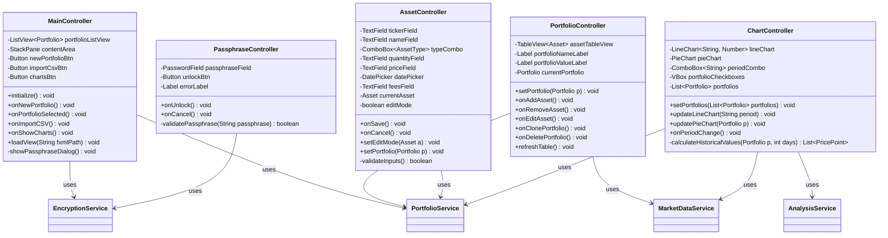

# UML Diagrams - PortfolioTracker

> **Version**: 1.1  
> **Format**: Mermaid  
> **Last Updated**: 11 January 2026

---

## 1. Class Diagram - Complete

---

## 2. Class Diagram - Services

---

## 3. Class Diagram - API Clients

---

## 4. Class Diagram - Controllers

---

## 5. Sequence Diagram - Create Portfolio

---

## 6. Sequence Diagram - Import CSV

---

## 7. Sequence Diagram - View Charts

---

## 8. Sequence Diagram - Encryption Flow

---

## 9. Component Diagram

---

## 10. State Diagram - Portfolio Lifecycle

---

## 11. Entity Relationship Diagram

---

## 12. Package Diagram

---

*UML Diagrams - PortfolioTracker v1.1 - Mermaid Format*
